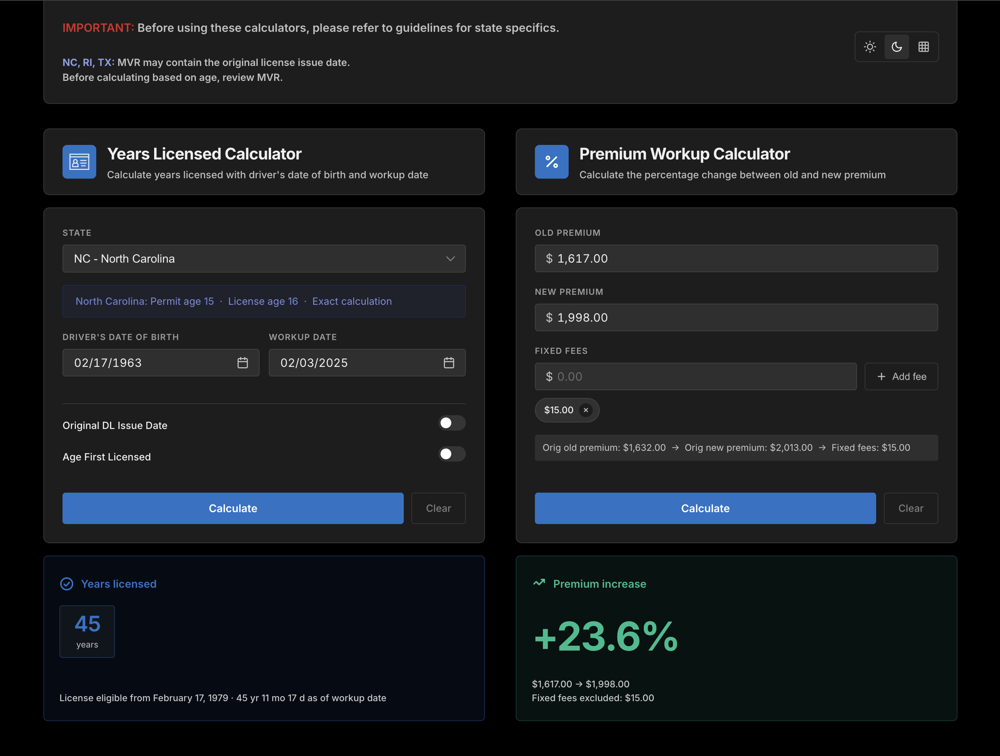

[](https://github.com/markwaldron7string/ap-workup-angular/actions/workflows/ci.yml)
[](https://angular.dev)
[](https://typescriptlang.org)
[](https://playwright.dev)
[](https://ap-workup-angular.vercel.app)
[](https://opensource.org/licenses/MIT)

# AP Workup Tool

Insurance calculators for quickly checking driver experience and premium changes for underwriting reviews.

**Live demo:** [ap-workup-angular.vercel.app](https://ap-workup-angular.vercel.app/)



## Calculators

### Years Licensed Calculator

Calculates years licensed using the driver's date of birth, workup date (quote date), and state-specific permit/license age rules.

Supports:

- Exact calculation states: Massachusetts, North Carolina, California
- New Jersey month-bracket output
- Range output for other states
- Optional age-first-licensed override
- Optional original DL issue date override
- One-click copy button on each result card

### Premium Workup Calculator

Calculates percentage change between old and new premium values.

Supports:

- Premium increase, decrease, and flat-change output
- Fixed fee exclusions
- Clear/reset behavior
- One-click copy button on each result card - copies the result to the clipboard in a clean plain-text format
- Light, dark, and original (retro spreadsheet-styled) theme toggle that persists: user's preference remains after user closes the app and returns.

### Original (Spreadsheet) Theme

A throwback to the Excel workbook this app replaces.

- Years Licensed keeps the same card as the other themes, restyled with yellow input cells and a green result box
- Premium Workup becomes the original table: example rows, "TYPE NEW DATA" rows, yellow input columns, and green result columns for Change Amount and % Change
- Results fill in when you leave a cell or press Enter - there is no Calculate button in the table
- Arrow keys move between cells
- Fixed fees are added per row with Enter or the + button and removed with ×
- The bar under the table shows the selected row's breakdown and warnings, with Clear row, Clear all, and Copy
- Rows are not saved: they reset on page reload and are separate from the premium form in the light and dark themes
- On narrow screens the selected row is shown one field per line with Prev/Next

## Tech Stack

- Angular 22
- TypeScript
- pnpm
- Vitest
- jsdom
- Playwright
- ESLint (angular-eslint) and Prettier
- GitHub Actions

## Project Structure

```text
src/
  app/
    app.ts                      page shell: notes, theme toggle, the two calculators
    core/                       app-wide services
      theme.service.ts          current theme, saved in localStorage
      clipboard.service.ts      copy to clipboard and "Copied" feedback
    shared/                     code both calculators use
      date-utils.ts             parse, format, add months, date difference
      currency-utils.ts         parse and format money
      calc-result.ts            the result model the calculators hand to the UI
      ui/                       reusable components: date input, calendar popup,
                                result card, theme toggle, decimal input, copy button
    features/
      years-licensed/
        state-rules.ts          permit and license ages for every state
        years-licensed.ts       the calculation (plain functions, no Angular)
        years-licensed-calculator.ts
      premium/
        premium.ts              the calculation (plain functions, no Angular)
        premium-form.store.ts   state of the form (light and dark themes)
        premium-sheet.store.ts  state of the table (original theme)
        premium-calculator.ts   chooses the form or the table by theme
        premium-form.ts
        premium-sheet.ts
  styles.css                    imports the stylesheets in src/styles/
  styles/                       global styles split by area; tokens.css holds the theme colours
  testing/                      helpers shared by the unit tests
e2e/                            Playwright end-to-end tests
```

The business rules live in plain TypeScript files (`state-rules.ts`, `years-licensed.ts`, `premium.ts`) so they can be read and tested without Angular. Components only collect input and display results.

## Getting Started

Install dependencies:

```bash
pnpm install
```

Start the local development server:

```bash
pnpm start
```

Then open:

```text
http://localhost:4200/
```

## Available Scripts

Run the app locally:

```bash
pnpm start
```

Build for production:

```bash
pnpm build
```

Run unit tests in watch mode:

```bash
pnpm test
```

Run unit tests once for CI:

```bash
pnpm test:ci
```

Run unit tests once with a coverage report:

```bash
pnpm test:coverage
```

Run end-to-end tests (starts the app if it is not already running on `http://localhost:4200`):

```bash
pnpm test:e2e
```

Run end-to-end tests in Playwright's interactive UI:

```bash
pnpm test:e2e:ui
```

Lint the code:

```bash
pnpm lint
```

Format the code with Prettier, or check that it is formatted:

```bash
pnpm format
pnpm format:check
```

## Testing

Unit tests are written with Vitest through Angular's unit test builder. End-to-end tests are written with Playwright and run in Chromium.

Spec files live beside the code they test:

```text
src/app/features/years-licensed/state-rules.spec.ts               state table against the guideline ages
src/app/features/years-licensed/years-licensed.spec.ts            every years licensed outcome
src/app/features/premium/premium.spec.ts                          percentage change, fees, clipboard text
src/app/features/premium/premium-form.store.spec.ts               premium form behaviour
src/app/shared/date-utils.spec.ts, currency-utils.spec.ts         parsing and formatting
src/app/shared/ui/date-input/                                     date mask and the date field
src/app/core/                                                     theme and clipboard services
src/app/features/years-licensed/years-licensed-calculator.spec.ts the years card through its DOM
src/app/features/premium/premium-calculator.spec.ts               the form and the original theme table through their DOM
src/app/app.spec.ts                                               the page as a whole: theme switch and layout
```

End-to-end specs live in `e2e/`:

```text
e2e/ap-workup.spec.ts     calculator flows, theme toggle, original theme premium table
e2e/deep-verify.spec.ts   state-by-state audit of years licensed results
```

Playwright starts the dev server for the run. If `pnpm start` is already running locally, it uses that instead.

## Continuous Integration

GitHub Actions runs on pushes and pull requests to `main`.

The CI workflow:

1. Installs dependencies with pnpm
2. Checks formatting with `pnpm format:check`
3. Lints with `pnpm lint`
4. Runs `pnpm test:ci`
5. Runs `pnpm build`
6. Installs Chromium for Playwright
7. Runs the Playwright end-to-end tests with `pnpm test:e2e`

Workflow file:

```text
.github/workflows/ci.yml
```
